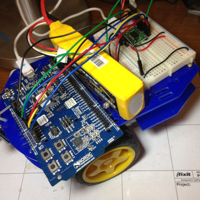

In this project, we will control two motors connected to the Nordic
nRF51-DK board via TB6612FNG, from the Nordic nRFToolbox App. It
demonstrates PWM and NUS (Nordic UART Service).

Read details at:

http://electronut.in/nrf51-TB6612FNG-test

For nRF51 GCC build setup see:

http://electronut.in/nrf51-adc-test/

